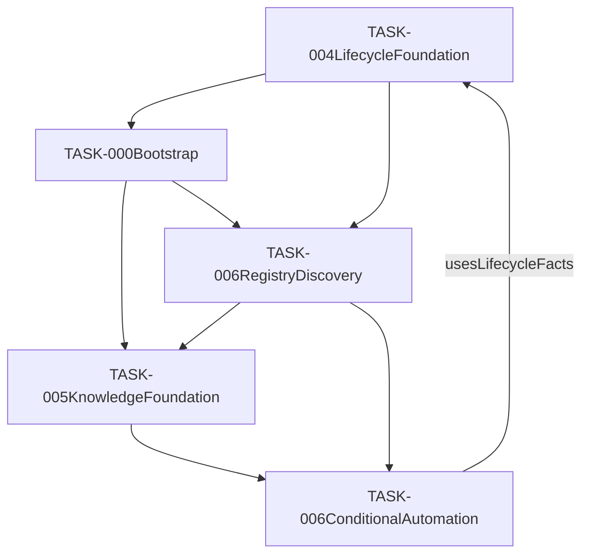

# AI Development OS — Foundation Improvement Integration Plan

## 1. Document Control

| Item | Value |
|---|---|
| Authoring Role | Foundation Design Planner |
| Active Project | `/home/baisound/projects/javascript-roulette` |
| Active Task | `TASK-004` |
| Phase | Pre-Completion Foundation Improvement Integration Planning |
| Runtime Interface | `INLINE_CHAT_LINUX` |
| Effective Date | 2026-07-31 |
| Scope | Responsibility placement, dependency design, roadmap restructuring, and next-design planning only |
| Allowed persistent output | This file only |
| Result | `FOUNDATION_INTEGRATION_PLAN_READY_WITH_CONDITIONS` |

This is a planning artifact. It neither authorizes nor performs an Architecture,
Role, Common, Workflow, Registry, Schema, Template, implementation, Git,
Completion Review, or Archive update.

## 2. Executive Summary

TASK-004 Phase 1 has a bounded implementation approval, but its operation
revealed cross-cutting improvement candidates. The canonical Architecture already
places most of them conceptually: project bootstrap in proposed `TASK-000`,
knowledge and failure learning in `TASK-005`, and resolvers/automation in
`TASK-006`. The primary gap is not a missing destination; it is the absence of
approved detailed specifications, schemas, templates, phase gates, and acceptance
tests for those destinations.

Recommended placement:

1. Create `TASK-000` as the prerequisite Project Bootstrap and Classification
   task; it establishes a portable Project/Runtime/Risk profile before a project
   uses TASK-005 or TASK-006 services.
2. Keep Failure Knowledge, patterns, lessons, ADR-equivalent decisions, and
   Knowledge Pack selection logic in `TASK-005`.
3. Start TASK-006 with its read-only Registry/Discovery and runtime/startup
   foundations, then place reusable resolution, Owner decision support,
   reliability, documentation automation, and Advanced Guard capabilities in its
   later conditional-automation phases. Context Guard MVP and Cost Guard MVP are
   no longer TASK-006 scope; they are moved to TASK-004 Phases 1.5–1.8.
4. Preserve TASK-004 as the cross-task Lifecycle authority and consumer of
   resolver outputs. Do not add Automation implementation to TASK-004.

The plan is deliberately non-blocking for the technical quality of TASK-004 Phase
1. It recommends completing the remaining separately governed Completion Review
only after the Owner decides the Git/evidence boundary and records this improvement
placement as a P0 planning prerequisite—not after implementing all improvements.

## 3. Current Foundation State

| Area | Recorded current state | Classification |
|---|---|---|
| Architecture | Ver.2.1, `CURRENT_CANONICAL`; Machine Markdown is canonical authority | Current canonical |
| Lifecycle Foundation | TASK-004 Ver.1.3, `CURRENT_CANONICAL` | Current canonical |
| TASK-004 Phase 1 | `IMPLEMENTATION_APPROVED`; 88 PASS / 0 FAIL; 23 / 23 probes; Critical/High 0/0 | Implemented and verified within WSL2/ext4 boundary |
| Documentation consistency | `CROSS_FORMAT_CONSISTENCY_PASS` | Verified evidence |
| TASK-000 / TASK-005 / TASK-006 | `PROPOSED / NOT_STARTED / NOT_AUTHORIZED` | Proposed only |
| Completion Review / Archive | `NOT_STARTED` | Not authorized by this plan |

The Architecture’s older inherited roadmap text contains historical timing and
priority statements. The Ver.2.1 Current Synchronization Addendum is the
current-machine authority for the proposed TASK placement; historical passages are
not silently reinterpreted as implementation authorization.

## 4. Source Evidence

| Path | Authority / use in this plan |
|---|---|
| `/home/baisound/projects/ai-team/architecture/AI_Development_OS_Architecture_Ver2.1.md` | Machine canonical Architecture; ownership, runtime, roadmap, documentation governance |
| `/home/baisound/projects/ai-team/specifications/TASK-004_AI_Development_OS_Lifecycle_Foundation_Ver1.3_Current_State_Integrated.md` | Machine canonical lifecycle boundary and TASK-004/TASK-005 interface |
| `documentation-decision-manifest.md` | Current planning context and prior improvement candidates; older draft-status blocks are historical planning context, not current document status |
| `document-version-coverage-ver1.1-to-ver1.2-reassessment-01.md` | Coverage gate evidence |
| `cross-format-consistency-check.md` | Cross-format verification evidence; immutable |
| `final-implementation-judgment.md` | Judge implementation approval and residual-risk boundary |
| `project-policy-review.md` | Commit/closure governance conditions; historical policy evidence |
| `registry/document-registry.yaml` | Current discovery index, not a source of binding design content |
| `registry/current-state.md` | Current navigation snapshot, subordinate to canonical sources and historical evidence |

## 5. Existing Design Inventory

| Candidate | Authority / status | Human / machine / summary | Related task / phase | Update candidate now | Duplicate / conflict assessment |
|---|---|---|---|---|---|
| Architecture Ver.2.1 | Machine canonical, current | DOCX companion / Markdown authority / Summary aid | All Foundation tasks | No | Contains proposed TASK-000/005/006 placement |
| TASK-004 Ver.1.3 | Machine canonical, current | DOCX companion / Markdown authority / Summary aid | TASK-004 Lifecycle | No | Defines interfaces; does not own Knowledge internals or Automation |
| `registry/document-registry.yaml` | Navigation index, current | Machine-readable index | TASK-006 future Registry implementation | No | Existing manually maintained registry is not the future automation implementation |
| `registry/current-state.md` | Current-state snapshot | Markdown navigation aid | TASK-004 current state | No | Must remain evidence-derived |
| `registry/operational-improvements.md` | Improvement registry | Markdown navigation aid | P0 roadmap inputs | No | OP-005 through OP-011 overlap proposed TASK-006 scope |
| Registry Maintenance Spec Ver.1.0 | Ready-for-review specification | Markdown | Registry governance | No | Provides maintenance process, not Task bootstrap schema |
| Role / Common / Workflow specifications | Shared specifications | Markdown and summaries | Cross-cutting | No | May require future approved updates after detailed design |
| TASK-005 detail references | Historical / referenced design candidates; no current task artifact | Existing references only | Knowledge Foundation | No | Must be reconciled with Ver.2.1 before formal task definition |
| TASK-006 design | Mentioned in Architecture and Lifecycle boundary only; no current task artifact | No active canonical task specification discovered | Registry / Automation | No | New detailed specification required |

Git tracking observation applies only to the active project: the task Evidence
set remains untracked pending a separately approved commit boundary. Readable
untracked Evidence remains Evidence and must not be treated as absent.

No Foundation `PROJECT.md` was discovered. The workspace policy requires task
artifacts under an Active Project, whereas legacy Foundation task directories also
exist. A future TASK-000/005/006 task-artifact root therefore cannot be inferred
from existing paths and requires an Owner decision before task creation.

## 6. Gap Analysis

| Domain | Existing coverage | Gap judgement | Required follow-up |
|---|---|---|---|
| Lifecycle integrity | TASK-004 states, journal, lease, recovery, evidence enforcement | Already designed and sufficient for Phase 1 | Keep as shared dependency |
| Project Bootstrap | Mentioned only in Architecture roadmap | Needs new specification, schema, template, and validation | TASK-000 |
| Knowledge Foundation | Architecture and TASK-004 interface designed | Designed but insufficient for implementation | TASK-005 detailed redesign |
| Failure Knowledge | Candidate list exists, not registered | Proposed only | TASK-005 schema and governance |
| Workspace Registry | Index architecture and maintenance rules exist | Designed but insufficient; current registry is manual | TASK-006 Phase 1 |
| Runtime resolution | Current runtime rules are documented | Designed but insufficient for reusable resolution | TASK-000 profile + TASK-006 resolver |
| Owner decision automation | Automation architecture implies human approval queue | Mentioned only | TASK-006 specification |
| Model policy | Evaluation axes exist in Lifecycle Foundation | Needs provider capability profile and fallback policy | TASK-006 policy/specification |
| Documentation governance | Current canonical-document model is implemented as process | Needs automated resolver/validator design | TASK-006 |
| Context / cost control | P0 Architecture principles exist | Needs enforceable schemas, metrics, and tests | TASK-006, staged after bootstrap |

## 7. Project Bootstrap and Classification

Recommend a new `TASK-000 — Project Bootstrap & Classification`. It runs before
project-specific delivery tasks and produces a Project Manifest rather than
modifying any existing project artifact.

Minimum outputs:

- Project identity, owner, root, and project-local policy references.
- Primary and secondary project type, domain, capabilities, and risk tags.
- Project DNA: goals, audiences, delivery mode, maintenance horizon, constraints,
  data sensitivity, and expected external integrations.
- Technology, compliance, runtime, toolchain, and filesystem profiles.
- Initial Knowledge Pack request criteria—not a generated Knowledge Pack.
- Initial Registry and Summary entries, subject to the Registry’s future approved
  maintenance workflow.

Bootstrap must stop without writes when roots, runtime, ownership, or required
Owner decisions are ambiguous.

## 8. Project Type Taxonomy

Use a composable classification rather than a single enum:

```yaml
project_classification:
  primary_type: software_development
  secondary_types: [ai_automation_development]
  domains: [web_application]
  capabilities: [browser_runtime, test_automation]
  risk_tags: [data_integrity, workflow_governance]
```

Minimum primary types: Software Development, AI/Automation Development, Video
Editing, Video Generation, Music Production, Streaming/Broadcast, Branding/Design,
Documentation/Publishing, Research, Business/Corporate Operations, and Hybrid/
Multi-domain Project. A Hybrid project requires an Owner-confirmed primary type,
at least one secondary type, and per-domain risk tags; it must not fabricate a
single type merely to select a workflow.

## 9. Project DNA

`ProjectDNA` is a stable, versioned profile separate from mutable task status. Its
minimum fields are identity, purpose, type classification, target outcomes,
stakeholders, delivery channels, asset/data sensitivity, technology and toolchain
constraints, maintainability horizon, approved domains, and change-control
requirements. It is created by TASK-000 and consumed by TASK-005 and TASK-006;
TASK-004 may reference it but must not alter it.

## 10. Risk Profile

The `RiskProfile` must separately record confidentiality, integrity, availability,
financial/cost, legal/compliance, operational safety, external-side-effect, and
evidence-retention risks. Each tag needs severity, owner, acceptance authority,
review cadence, and safe-stop effect. This prevents Project Type from being used as
a proxy for risk.

The known WSL2/ext4 and physical-power-loss limitations remain TASK-004 residual
risks. They are input candidates to a future Runtime/Project Risk Profile, not
evidence that a broader durability guarantee exists.

## 11. Knowledge Foundation

TASK-005 owns the Knowledge Asset lifecycle:

- Global, Domain, Project-local scope;
- taxonomy, vocabulary, provenance, revision, trust, freshness, confidence, and
  sensitivity;
- resolution/ranking and version-pinned Knowledge Pack production;
- usage/effectiveness, invalidation, promotion/demotion, and impact notification.

TASK-004 sends a Knowledge Resolution Request and receives a result; it controls
whether the returned Pack becomes a Context Manifest input. TASK-005 never mutates
Task Status, and TASK-004 never promotes or revises a Knowledge Asset.

## 12. Failure Knowledge Registry

Place the registry in TASK-005, with the following scope layers:

| Layer | Intended content | Promotion rule |
|---|---|---|
| Global Failure Knowledge | Cross-domain invariant failures and mitigations | Owner/Domain review before activation |
| Domain Failure Knowledge | Domain/tool/runtime-specific recurrence patterns | Domain review and provenance check |
| Project-local Failure Knowledge | Project-specific failures, constraints, and known BAD knowledge | Project Owner authority within its boundary |

Candidate entries only, not registered by this plan: missing-file misclassification,
pre-probe environment inference, Foundation role-path omission, evidence-path
misresolution, untracked-Evidence misclassification, shell-dialect mismatch,
Agent Window/Inline Chat runtime confusion, historical-output collision, Tester
source modification, durability-error suppression, premature Event-based commit,
string-to-Boolean coercion, unannounced filename change, and Human/Machine
authority misresolution.

Each future entry needs a fingerprint, observation/evidence links, environment
scope, failure mode, safe action, prohibited inference, confidence, freshness, and
promotion/demotion history.

## 13. Orchestration Foundation

TASK-006 owns reusable automation and resolution, with explicit read-only planning,
Owner approval gates, and no inference of authority. Core components are Project,
Knowledge, and Risk Resolvers; Orchestrator Instruction Compiler; Canonical Prompt
Generator; Role Startup Package Generator; Role Activation Validator; execution
reliability; worktree evidence awareness; canonical-document resolution; and
documentation verification/synchronization.

The Automation layer consumes Task lifecycle facts from TASK-004 and Knowledge
results from TASK-005. It cannot declare a lifecycle transition, policy update,
promotion, commit, closure, or archive merely because a resolver found evidence.

## 14. Owner Decision Support

Place the Owner Decision Support Generator in TASK-006. It produces an
**Authorization Proposal**, never an authorization itself.

Inputs: Owner Intent, Current Canonical State, Active Gate, latest Evidence,
Critical/High findings, Allowed/Protected paths, Runtime Interface, Project Type,
Risk Profile, requested Role, model capability requirements, and collision checks.

Outputs: Exact Prompt Package, Role Startup Package, Runtime Preflight, Allowed and
Protected File Lists, Validation Plan, Stop Conditions, Completion Pause, recommended
model/cost tier, retry classification, and concise Human Approval Summary.

The output has a mandatory `owner_approval_required: true` marker. A missing,
expired, or scope-mismatched Owner approval produces `NOT_AUTHORIZED` / no-write
Safe Stop.

## 15. Runtime Interface and Environment Resolution

The design must distinguish these facts:

| Concern | Source / owner |
|---|---|
| User Workspace | Bootstrap profile and Owner-approved project identity |
| Agent Runtime / Runtime Interface | Runtime probe at role activation |
| Command Transport / Shell Provider | Runtime resolver |
| Filesystem / Canonical Path Space | Runtime probe plus root resolver |
| Toolchain Provider | Capability matrix |

Observed current interface classification is:

```yaml
cursor_runtime_interfaces:
  inline_chat:
    observed_runtime: linux
    shell: bash
    linux_paths_directly_available: true
    suitable_for_linux_native_tasks: true
  agent_window:
    observed_runtime: windows
    shell: powershell
    linux_paths_directly_available: false
    suitable_for_linux_native_tasks: false
```

TASK-000 records a minimal current Runtime Profile for a new project. TASK-006
implements the reusable Runtime Interface, Environment, Shell, Root, and Toolchain
Resolvers and their capability tests. Neither may infer runtime from UI labels,
historical sessions, or apparent paths.

## 16. Role Model Policy

The provided role-to-model mapping is a policy candidate, not a durable fixed
provider contract. Store a future machine policy as a Role Model Policy that
references a Provider Capability Profile:

```yaml
model_selection_inputs:
  role: required
  task_complexity: required
  risk_and_evidence_sensitivity: required
  independence_requirement: required
  context_size: required
  required_tools: required
  cost_ceiling: required
  project_type: required
  provider_availability: required
fallback_requires: documented_reason_and_owner_policy
```

Initial defaults may retain the Owner’s candidate mapping (Terra for Orchestrator,
Builder, Tester; Gemini Pro for Critic and Judge; Luna for Policy/Documentation/
Registry; Mini for Summary/Archive) only when the provider profile confirms current
availability and capabilities. Independent review must not silently fall back to
the same model/session when the requested independence property is mandatory.

## 17. Documentation Governance

Keep the three-part Canonical Document Set: Human Canonical Companion, Machine
Canonical Authority, and Context Economy Summary. TASK-006 should design—not yet
implement—the Canonical Document Manifest, ASCII-safe canonical path policy,
Version Coverage Gate, Cross-format Consistency Matrix, and output-path collision
check.

Required rules: immutable historical Evidence and baselines, explicit
CURRENT/DEPRECATED/SUPERSEDED classifications, manifest-driven resolution, no
unannounced filename rename, no Human/Machine authority inference, and Safe Stop on
missing path, duplicate identity, stale hash, or format disagreement.

## 18. TASK Placement Matrix

| Capability | Suggested task / phase | Rationale |
|---|---|---|
| Project identity, type, DNA, initial risk/runtime profile | TASK-000 Phases 1–5 | Needed before project-specific resolution |
| Initial Knowledge selection criteria and Registry/Summary request | TASK-000 Phases 6–8 | Bootstrap request, not Knowledge/Registry ownership |
| Lifecycle / Journal / Recovery / Gate | TASK-004 existing foundation | Existing lifecycle authority |
| Failure Knowledge, patterns, ADR, freshness, promotion | TASK-005 Phases 1–12 | Knowledge Asset lifecycle ownership |
| Project / Knowledge / Risk resolution | TASK-006 Phases 1–3 | Cross-cutting deterministic resolution |
| Runtime, environment, shell, root, toolchain resolvers | TASK-006 Phases 4–5 | Reusable operational enforcement |
| Instruction compiler, Owner decision support, startup validation | TASK-006 Phases 6–9 | Automation inputs and routing support |
| Reliability, retry, session lifecycle, worktree evidence | TASK-006 Phases 10–12 | Execution operational foundation |
| Document resolver, synchronizer, cross-format verification | TASK-006 Phases 13–15 | Documentation automation, not content authority |
| Context Guard MVP | TASK-004 Phase 1.5 | Highest-priority bounded guard before Phase 2 |
| Foundation Guard MVP | TASK-004 Phase 1.6 | Guard Foundation invariants and route safety |
| Cost Guard MVP | TASK-004 Phase 1.7 | Highest-priority bounded cost control |
| Budget / retry / review-depth / artifact-size / model-cost hard stops | TASK-004 Phase 1.8 | Complete Guard MVP limits before Phase 2 |
| Advanced Guard: Dynamic Context Optimization, AI Model Selection, Provider Selection, Prompt Compression, Knowledge Ranking, Cache Optimization, Dynamic Budget Optimization | TASK-006 future Advanced Guard | Advanced automation after Guard MVP completion |

## 19. Dependency Graph



The final edge is a read/validate interface, not a dependency that permits
TASK-006 to mutate TASK-004 state. Avoid a cycle by defining `TASK-000` as
bootstrap-output producer, TASK-006 Phase 1 as discovery-only, `TASK-005` as
Knowledge-output producer, and later TASK-006 phases as orchestration consumers.
TASK-004 remains the independent lifecycle authority.

## 20. Proposed Internal Phases

| Task | Ordered phases |
|---|---|
| TASK-000 | 1 Runtime/workspace identification; 2 project identity; 3 type/domain classification; 4 Project DNA; 5 risk/compliance; 6 initial knowledge selection request; 7 initial Registry/Summary request; 8 bootstrap validation |
| TASK-005 | 1 taxonomy; 2 asset schema; 3 scope; 4 failure schema; 5 patterns; 6 ADR/decisions; 7 resolution/ranking; 8 Pack; 9 application verification; 10 promotion/demotion; 11 freshness/invalidation; 12 governance |
| TASK-004 | Phase 1 Completed; Phase 1.5 Context Guard MVP; Phase 1.6 Foundation Guard MVP; Phase 1.7 Cost Guard MVP; Phase 1.8 Budget Limit, Retry Limit, Review Depth Limit, Artifact Size Limit, Model Cost Policy, and Hard Stop; Phase 2 begins only after Guard MVP completion |
| TASK-006 | 1 Registry/discovery schema and read-only rebuild; 2 runtime/environment/shell/root resolution; 3 activation validation and startup package; 4 Project/Risk resolution; 5 Knowledge Resolver integration after TASK-005 MVP; 6–9 instruction compilation, Owner support, reliability, restart/session/worktree Evidence; 10–12 document resolution/synchronization, probe/mutation/fault injection; 13 Advanced Guard (Dynamic Context Optimization, AI Model Selection, Provider Selection, Prompt Compression, Knowledge Ranking, Cache Optimization, Dynamic Budget Optimization); 14 conditional automation; 15 end-to-end governance validation. Context Guard MVP and Cost Guard MVP are moved to TASK-004 Phases 1.5–1.8. |

Change from the supplied sequence: make Registry/Discovery and Runtime resolution
precede instruction compilation and Knowledge Resolution; otherwise a generated
prompt could use a wrong command dialect, path space, or unknown canonical input.
Make task/role model selection a subcapability of startup validation after runtime
and sensitivity facts are known.

## 21. Missing Specifications

- TASK-000 Project Bootstrap & Classification Specification.
- TASK-005 Knowledge Foundation / Failure Knowledge Governance Specification.
- TASK-006 Orchestration and Automation Foundation Specification.
- Runtime Interface and Environment Resolution Specification.
- Owner Decision Support / Instruction Compiler Specification.
- Role Model Policy and Provider Capability Profile.
- Session Lifecycle and Retry / Safe Restart Specification.
- Canonical Document Automation and Cross-format Verification Specification.
- Foundation Improvement Roadmap with versioning and acceptance gates.

## 22. Missing Schemas

- Project Manifest, Project Type Taxonomy, Project DNA, Risk/Compliance Profile.
- Runtime Interface, Environment Capability Matrix, Shell Provider, Root Resolver.
- Knowledge Asset, Failure Knowledge Entry, Knowledge Pack, Knowledge Resolution.
- Owner Decision Package, Prompt Package, Role Startup Package, Activation Result.
- Provider Capability Profile, Model Selection Record, Cost Budget.
- Retry Classification, Resume Package, Session Lifecycle, Worktree Evidence Type.
- Canonical Document Manifest, Consistency Matrix, Documentation Operation Record.

## 23. Missing Templates

- TASK-000 bootstrap report and Project Manifest review.
- Failure Knowledge entry, pattern/anti-pattern, and ADR-equivalent decision record.
- Owner authorization proposal and Human approval summary.
- Role startup prompt package and runtime preflight.
- Resolver result and safe-stop / `INVALID_START` report.
- Documentation synchronization proposal and independent consistency report.
- Cost/context budget and session handoff template.

## 24. Human Documentation Update Map

| Proposed target | Target chapter / operation | Human content | Diagram | Proposed version |
|---|---|---|---|---|
| Architecture human companion | Roadmap, Layer 5/6, Bootstrap addition | System rationale, task ownership, Owner decisions | Dependency / capability map | Next approved Architecture version |
| TASK-004 human companion | Interface clarification only | TASK-004 boundary and no-automation rule | Lifecycle-to-resolver boundary | Next lifecycle clarification, only if needed |
| New TASK-000 human specification | New document | Bootstrap decisions and classification examples | Bootstrap flow | 1.0 |
| New TASK-005 human specification | New document | Knowledge/failure governance | Knowledge scope/promotion | 1.0 |
| New TASK-006 human specification | New document | Runtime and Owner-support operations | Resolution / approval flow | 1.0 |

Every target requires a separate Owner-approved document update plan, Human/Machine
pairing, versioning decision, and cross-format verification. No target is updated
by this plan.

## 25. Machine Documentation Update Map

| Proposed target | Exact future content | Schema / Role / workflow impact |
|---|---|---|
| Architecture Markdown | TASK placement, dependencies, phased roadmap | Architecture version update; no direct runtime implementation |
| TASK-004 Markdown | Stable interfaces only, if a new interface is approved | Lifecycle compatibility review required |
| TASK-000 Markdown | Canonical bootstrap rules and output contracts | New schemas/templates; Owner gate |
| TASK-005 Markdown | Asset/failure lifecycle and resolution contracts | Knowledge governance and TASK-004 boundary review |
| TASK-006 Markdown | Resolver, compiler, reliability, document-automation contracts | Role/startup, model, context/cost policy impacts |
| Registry / Current State | Derived references only after each canonical update | Registry Maintenance UPDATE/VERIFY |

Backward compatibility rule: future contracts use versioned fields and
`additionalProperties` handling; a new resolver must not reinterpret historical
Evidence or existing untracked worktree artifacts.

## 26. Priority Matrix

| Item | Priority | Urgency | Dependency | Risk if deferred | Suggested task / phase | Completion impact |
|---|---|---|---|---|---|---|
| Placement and non-overlap decision | P0 | Immediate | Current canonical evidence | Scope creep / duplicated design | This plan | Document before Completion Review |
| Project Bootstrap minimum design | P0 | Before next project | TASK-004 boundary | Wrong project/runtime classification | TASK-000 1–5 | Non-blocking for TASK-004 |
| Runtime preflight/profile | P0 | Before next Linux-native project | TASK-000 then TASK-006 | Wrong shell/path/runtime | TASK-000 1, TASK-006 4–5 | Non-blocking for TASK-004 |
| Failure Knowledge schema | P1 | Before repeated operational work | TASK-005 taxonomy | Repeated known failures | TASK-005 1–4 | Non-blocking for TASK-004 |
| Owner Decision Support | P1 | Before scalable multi-role use | TASK-000 and TASK-006 resolvers | Unsafe or costly manual prompts | TASK-006 6–9 | Non-blocking for TASK-004 |
| Context Guard MVP | P0 | Before every other Task | TASK-004 Phase 1 | Context exhaustion / unsafe continuation | TASK-004 Phase 1.5 | Blocks Phase 2 and later |
| Cost Guard MVP | P0 | Before every other Task | TASK-004 Phase 1.5–1.6 | Unbounded model spend | TASK-004 Phase 1.7 | Blocks Phase 2 and later |
| Budget Guard / Hard Stop MVP | P0 | Before every other Task | TASK-004 Phase 1.7 | Budget, retry, review, artifact, or model-cost overrun | TASK-004 Phase 1.8 | Blocks Phase 2 and later |
| Documentation automation | P2 | After resolver foundations | Canonical manifest | Cross-format operational cost | TASK-006 13–15 | Non-blocking for TASK-004 |
| Conditional full automation | P2 | Future | All above | Unsafe autonomous action | TASK-006 17–18 | Non-blocking for TASK-004 |

Minimum viable versions are schema-and-validation-first, read-only where possible.
Full versions add controlled mutation only after authorization, test, policy, and
independent review gates.

## 27. Release / Milestone Proposal

1. **M0 — Foundation placement record**: this plan, Owner decisions, no runtime
   implementation.
2. **M1 — TASK-004 governance completion**: approved commit boundary, Completion
   Review decision, separately governed closure readiness; no dependency on
   implementing TASK-000/005/006.
3. **M2 — TASK-004 Guard MVP**: Phase 1.5 Context Guard, Phase 1.6 Foundation
   Guard, Phase 1.7 Cost Guard, and Phase 1.8 hard limits. Phase 5A is paused
   until this milestone is complete.
4. **M3 — TASK-000 Minimum Bootstrap**: profiles, classification, validation, and
   initial resolver inputs before the next new project.
5. **M4 — TASK-006 Registry/Startup and Advanced Guard**: read-only discovery, runtime
   resolution, startup packages, and reliability gates.
6. **M5 — TASK-005 Knowledge MVP**: failure knowledge and Pack resolution with
   explicit governance, using Registry/Discovery interfaces.
7. **M6 — Controlled Automation**: documentation operations and conditional
   automation following independent validation.

## 28. TASK-004 Completion Impact

The only required pre-Completion work is to preserve this plan as a responsibility
placement record and obtain Owner decisions on its P0 recommendations. It is not
necessary—and would be scope expansion—to implement TASK-000, TASK-005, or TASK-006
before TASK-004 Completion Review.

Completion remains separately conditioned by the Project Policy record: the Owner
must decide the Git/evidence commit boundary, and any completion/closure action
needs an authoritative record. This plan does not alter that condition.

## 28A. Owner Priority Amendment — Guard Roadmap and Phase 5A Pause

```text
Phase 1 — Completed
↓
Phase 1.5 — Context Guard MVP
↓
Phase 1.6 — Foundation Guard MVP
↓
Phase 1.7 — Cost Guard MVP
↓
Phase 1.8 — Budget Limit / Retry Limit / Review Depth Limit /
Artifact Size Limit / Model Cost Policy / Hard Stop
↓
Phase 2
```

Planning status only: `PAUSED_BY_OWNER_PRIORITY`.

Reason: Phases 1.5–1.8 are the highest Owner priority. Phase 5A Evidence is
preserved unchanged and Phase 5A resumes only after the Guard MVP is complete.
This is a roadmap statement, not a Runtime Status, Registry, Current State,
Summary, Manifest, implementation authorization, or lifecycle transition.

Guard Priority:

- Context Guard, Cost Guard, and Budget Guard take precedence over every Task.
- No Phase 2 or later work may start while a Guard MVP is incomplete.

## 28B. Git Policy and Phase Commit Rule

Every Phase must end in this order:

```text
Design → Review → Final Plan → Implementation Approval → Implementation →
Tester → Critic → Judge → Owner Approval → Single Commit → Clean Worktree →
Next Phase
```

Prohibited:

- Multiple Phases in one commit.
- Starting the next Phase before the current Phase completes.
- Committing unverified implementation.
- Mixing Evidence across Phases.

This policy defines the required future commit boundary only. It does not stage,
commit, tag, push, or otherwise perform a Git operation.

## 29. Recommended Next Actions

1. Owner reviews and confirms TASK placement, phase order, and priority decisions
   in this plan.
2. Orchestrator routes the separately authorized TASK-004 Completion Review only
   if its existing commit/policy prerequisites are met.
3. After TASK-004 completion is independently resolved, create a new task
   definition for TASK-000 rather than modifying this historical TASK-004 planning
   artifact.
4. Use TASK-000 outputs as the input gate for future TASK-005/TASK-006 detailed
   design.

## 30. Owner Decisions Required

1. Perform TASK-004 Completion Review after approving the commit/evidence boundary;
   do not wait for Foundation implementation.
2. Treat this placement/dependency plan as the maximum Foundation improvement work
   required before Completion Review.
3. Formally create TASK-000, without renumbering TASK-004/005/006.
4. Redesign TASK-005 and TASK-006 as new approved detailed specifications because
   their current coverage is insufficient for implementation.
5. Place Failure Knowledge Registry in TASK-005.
6. Split Runtime Interface work: minimal observed profile in TASK-000; reusable
   resolver and enforcement in TASK-006.
7. Place Owner Decision Support Generator in TASK-006 as an approval-proposal
   generator only.
8. Keep Role Model Policy as a cross-cutting machine policy owned by TASK-006,
   reviewed by Project Policy, and resolved through Provider Capability Profiles.
9. Create new Foundation versions only through a separate UPDATE proposal; the
   recommended targets are Architecture next version and new TASK-000/005/006
   specification sets.
10. Design the minimum bootstrap Runtime/Project/Risk Profile first.
11. Decide the authoritative Active Project and task-artifact root for future
    Foundation work before creating TASK-000/005/006; do not infer it from legacy
    `/home/baisound/projects/ai-team/tasks/` directories.

## 31. Risks and Deferred Items

- The current evidence supports WSL2/ext4 only; portability and physical
  power-loss claims remain deferred Safe-Stop conditions.
- A manual role/model mapping becomes stale without Provider Capability Profiles.
- Automation can accidentally collapse role independence; independent-review
  requirements need explicit model/session separation rules.
- A Registry is an index, not a lifecycle or knowledge canonical source.
- Failure candidates must not become global knowledge without provenance, scope,
  privacy, and Owner/Domain governance.
- Schema-first work can still create scope creep; every task needs bounded allowed
  files, tests, and independent review before implementation.

## 32. Lessons Learned

- A readable untracked artifact remains evidence; Git tracking is a distinct fact.
- Runtime, path space, command transport, and shell dialect are separate inputs.
- Human, Machine, and Summary formats require explicit authority and independent
  consistency checks.
- A durable Event must be verified by ordered acknowledgement, not inferred from
  existence.
- Historical Evidence names and paths require collision-safe output planning.
- Context, session, and cost limits are safety controls, not cosmetic optimization.

## 33. Final Recommendation

Approve this plan as a responsibility-and-dependency baseline, then keep TASK-004
Completion Review on its own governed path. Formally introduce TASK-000 first for
the next project, then design TASK-005 Failure Knowledge and TASK-006 resolver/
startup capabilities in bounded, independently reviewed tasks. Do not start any
implementation, document update, registry update, schema/template creation, commit,
push, closure, archive, TASK-005, or TASK-006 from this plan without a new Owner
authorization.

