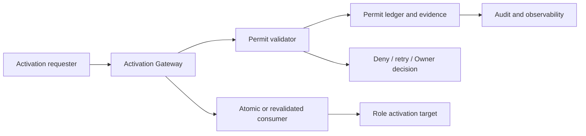

# TASK-004 Phase 1.6 — Foundation Guard MVP Design Candidate

## 1. Document Identity

- Title: `TASK-004 Phase 1.6 — Foundation Guard MVP Design Candidate`
- Parent Task: `TASK-004`
- Formal Phase: `TASK-004 Phase 1.6 — Foundation Guard MVP`
- Work Package ID: `PHASE_1_6_P0`
- Classification: TASK-004 transferred work package
- Artifact Type: Design Candidate
- Preparation Date: `2026-08-02`
- Design Authorization Evidence: `10cd2c8f53b79bc32a05154e0d4aa70389a44699`
- Baseline Commit: `10cd2c8f53b79bc32a05154e0d4aa70389a44699`
- Document Status: `DESIGN_CANDIDATE`
- Design Authorization: `EFFECTIVE`
- Implementation Authorization: `NOT_AUTHORIZED`

This document is a candidate for Design Critic and Design Judge review. It is
not an Implementation Artifact, Final Plan, Completion record, or Canonical
Lifecycle Transition.

## 2. Purpose and Design Boundary

This candidate designs the four Foundation Guard requirements transferred from
the reduced Phase 1.5 Context Guard Core MVP:

- R1 Complete Permit Ledger Fault Matrix.
- R2 Complete TOCTOU Matrix.
- R3 Complete Activation Entry Matrix.
- R4 Foundation-wide Role Activation Enforcement.

The candidate fixes design inputs, safety invariants, coverage rules, evidence
contracts, and future implementation boundaries. It does not create source,
tests, schemas, validators, runtime behavior, a Final Plan, or implementation
authorization. It does not change Canonical state, Completion, Closure, Archive,
Phase 5A, Phase 2, the Resume Checkpoint, or the Project Registry's existing 26
Missing Path entries.

## 3. Authority and Evidence Inventory

| ID | Exact Project-local path | Artifact role | Authority level | Relevant section / symbol | Requirements | Design use |
|---|---|---|---|---|---|---|
| E-01 | `docs/ai-team/tasks/TASK-004/phase1.6-design-authorization-decision.md` | Owner Decision | highest current Design authority | DA-01–DA-14; single Design path; R1–R4 | R1–R4 | fixes authorization, scope, content, and review boundary |
| E-02 | `docs/ai-team/tasks/TASK-004/phase1.6-task-definition.md` | Task Definition | approved governance input | §§4–11; requirement matrix and design inputs | R1–R4 | supplies problem/gap, acceptance, risk, and Safe Stop inputs |
| E-03 | `docs/ai-team/tasks/TASK-004/phase1.6-formal-kickoff-decision.md` | Owner Kickoff Decision | approved governance record | D-01–D-18; completion and exclusions | R1–R4 | preserves Work Package identity and exclusions |
| E-04 | `docs/ai-team/tasks/TASK-004/phase1.6-kickoff-package.md` | Kickoff Proposal | approved proposal | §§4–11; matrices, gates, role sequence | R1–R4 | provides proposed coverage and review gates |
| E-05 | `docs/ai-team/tasks/TASK-004/phase1.5-context-guard-completion-judge-decision.md` | Completion Judge | Phase 1.5 Judge | §8 Phase 1.6 Transfers; §20–§26 | R1–R4 | identifies transferred, not-closed scope and existing MVP baseline |
| E-06 | `docs/ai-team/tasks/TASK-004/phase1.5-context-guard-independent-critic-rereview-03.md` | Independent Critic | Phase 1.5 Critic | §§2, 6, 8, 14 | R1–R4 | confirms transferred coverage and no Phase 1.6 certification |
| E-07 | `docs/ai-team/tasks/TASK-004/phase1.5-context-guard-owner-decisions.md` | Owner Decisions | Phase 1.5 policy | §7 and policy tables | R1, R3, R4 | supplies ownership, activation boundary, and override constraints |
| E-08 | `src/context-guard/permit.mjs` | Existing implementation | technical baseline | `createCanonicalPreflightResult`, `issueRoleActivationPermit`, `validateRoleActivationPermit`, `consumeRoleActivationPermit` | R1, R2 | identifies current permit and ledger mechanisms |
| E-09 | `src/context-guard/activation-gateway.mjs` | Existing implementation | technical baseline | `createGuardedRoleActivationRequest`, `activateRoleWithPermit` | R2, R3, R4 | identifies current Gateway and handoff boundary |
| E-10 | `src/context-guard/role-runtime-executor.mjs` | Existing implementation | technical baseline | `executeAuthorizedRole` | R3, R4 | identifies internal executor and handoff target |
| E-11 | `src/context-guard/evidence-store.mjs` | Existing implementation | technical baseline | `writeImmutableEvidence`, `readVerifiedEvidence` | R1, R2 | identifies immutable evidence and verification boundary |
| E-12 | `src/context-guard/errors.mjs` | Existing implementation | technical baseline | `CONTEXT_*` error codes | R1–R4 | identifies existing error vocabulary and missing coverage candidates |
| E-13 | `tests/context-guard/context-guard.gateway.test.mjs` | Existing tests | verification baseline | `CG-GATE` tests | R2, R3, R4 | confirms valid handoff and binding rejection coverage |
| E-14 | `tests/context-guard/context-guard.permit.test.mjs` | Existing tests | verification baseline | permit lifecycle, ledger, lock tests | R1, R2 | confirms existing permit behavior and candidate gaps |
| E-15 | `tests/context-guard/context-guard.activation-adapters.test.mjs` | Existing tests | verification baseline | `CG-ADAPTER` tests | R3, R4 | confirms only Gateway imports the internal executor in current source |
| E-16 | `tests/context-guard/context-guard.path-safety.test.mjs` | Existing tests | verification baseline | `PS-TOCTOU` test | R2 | confirms existing filesystem race Safe Stop baseline |

The Workspace Repository is not used as authority.

## 4. Current Technical Baseline

### 4.1 Confirmed Components

| Component | Confirmed path / symbol | Observed fact | Phase 1.6 design relevance |
|---|---|---|---|
| Preflight and permit issue | `src/context-guard/permit.mjs`: `createCanonicalPreflightResult`, `issueRoleActivationPermit` | Preflight evidence is persisted and bound to permit issuance; permits have expiry and single-use fields | R1/R2 ledger state and binding coverage |
| Permit validation | `src/context-guard/permit.mjs`: `validateRoleActivationPermit` | Persisted evidence, checksums, request identity, decision, expiry, and ledger conditions are validated | R1/R2 revalidation and stale/replay behavior |
| Permit consumption | `src/context-guard/permit.mjs`: `consumeRoleActivationPermit` | Append-only event line, lock path, fsync/sync, reread verification, and consumed detection are present | R1 concurrent consumption and crash matrix |
| Activation Gateway | `src/context-guard/activation-gateway.mjs`: `activateRoleWithPermit` | Request is guarded, permit is validated, consumed, then handed to executor | R2/R3/R4 mandatory boundary |
| Internal executor | `src/context-guard/role-runtime-executor.mjs`: `executeAuthorizedRole` | Module declares intentional internal use; it requires a consumption event | R3/R4 direct bypass boundary |
| Public export | `src/context-guard/index.mjs` | Public export exposes `activateRoleWithPermit`, not the internal executor or permit internals | R3/R4 entry inventory baseline |
| Immutable evidence | `src/context-guard/evidence-store.mjs` | Evidence session records are written/read with integrity checks | R1/R2 observability and recovery |
| Override flow | `src/context-guard/override.mjs` | Baseline, Owner Override, canonical re-preflight, checksums, and binding are validated | R1/R2 configuration/override revision boundary |
| Error vocabulary | `src/context-guard/errors.mjs` | Existing codes include missing, invalid, expired, consumed, ledger, lock, unclassified entry, direct executor access, and unknown state errors | R1–R4 error classification |

### 4.2 Confirmed Activation Entry Baseline

The targeted source/test inventory found these current activation-related entries:

| Entry ID | Exact path / symbol | Type | Current boundary | Status |
|---|---|---|---|---|
| AE-01 | `src/context-guard/index.mjs` / `activateRoleWithPermit` | public module entry | delegates to Gateway | registered public entry |
| AE-02 | `src/context-guard/activation-gateway.mjs` / `activateRoleWithPermit` | Gateway function | validates and consumes before handoff | registered Gateway entry |
| AE-03 | `src/context-guard/role-runtime-executor.mjs` / `executeAuthorizedRole` | internal executor | imported only by Gateway in current adapter test | internal target, direct access prohibited |
| AE-04 | `tests/context-guard/context-guard.gateway.test.mjs` / direct Gateway calls | test invocation | test-only invocation of public Gateway | test entry, not production activation |
| AE-05 | `tests/context-guard/context-guard.activation-adapters.test.mjs` / adapter inventory assertions | test inspection | verifies source import boundary | verification entry, not production activation |

No `scripts/` directory or production CLI activation entry was found in the
targeted inventory. This is an observed result of the bounded search, not a
claim that arbitrary future paths cannot exist. The completeness method in §9
must be rerun against the authorized Design/implementation baseline.

### 4.3 Known Unresolved Foundation Gaps

The Phase 1.5 Judge and Critic explicitly leave the complete Permit Ledger Fault
Matrix, full Role-activation TOCTOU Matrix, complete Activation Entry Matrix,
unregistered-entry detection, activation uncertainty recovery, and
Foundation-wide enforcement transferred and not closed. This Design Candidate
does not claim those gaps are implemented or tested.

## 5. Foundation Guard Architecture

### 5.1 Logical Boundaries

The design uses one mandatory Gateway contract for the currently observed
production entry. Future entries must either use that Gateway or be explicitly
classified and Owner-approved before they can be considered in-scope. The
internal executor is not an activation entry and must not be imported by a
caller other than the Gateway.

### 5.2 Actors and Trust Boundaries

- Requester: supplies an activation request; untrusted until validated.
- Gateway: mandatory policy enforcement boundary; it must not trust caller
  claims without revalidation.
- Permit issuer: creates a bound Permit only from eligible persisted evidence.
- Permit validator: rereads and validates Permit, preflight, override, config,
  task, role, phase, scope, and ledger state.
- Permit ledger: append-only durability and event-chain boundary.
- Permit consumer: performs exclusive reservation/consumption and reread
  verification before handoff.
- Activation target: receives only a verified handoff with a consumption event.
- Owner/Recovery authority: resolves explicit uncertainty; it does not bypass
  the Gateway.
- Observability boundary: records minimal correlation and decision evidence,
  without copying sensitive Context content.

### 5.3 Architectural Invariants

There is one current mandatory production Gateway. If future entry inventory
finds more production adapters, they must implement the same Guard Contract and
be added to the R3 matrix; they are not silently accepted as parallel policy
implementations.

## 6. Core Safety Invariants

| Invariant ID | Statement | Requirement | Enforcement point | Violation result | Test oracle |
|---|---|---|---|---|---|
| INV-01 | No Permit means no activation | R1/R4 | Gateway before validation | DENY, no consumption | missing Permit rejected |
| INV-02 | Unknown or unregistered entry is denied | R3/R4 | entry inventory and Gateway | DENY / Owner decision required | unclassified entry test |
| INV-03 | Role/task/phase/scope mismatch is denied | R2/R4 | Permit validation | DENY | mutated binding rejected |
| INV-04 | Stale, expired, revoked Permit is denied | R1/R2 | validation and ledger | DENY | time/revocation fixtures |
| INV-05 | Replayed or consumed Permit is denied | R1/R2 | ledger before consume | DENY | second consume rejected |
| INV-06 | Activation is revalidated at use boundary | R2/R4 | Gateway immediately before consume/handoff | DENY or controlled RETRY | mutation between check/use |
| INV-07 | Ledger uncertainty fails closed | R1/R4 | ledger read/write/reread | DENY / Owner decision required | injected I/O failure |
| INV-08 | Authority uncertainty fails closed | R3/R4 | entry and ownership resolution | DENY / Owner decision required | unknown owner fixture |
| INV-09 | Direct executor bypass is denied | R3/R4 | module boundary and inventory | DENY; no target handoff | import/bypass inspection |
| INV-10 | Audit failure cannot silently allow activation | R1/R4 | event durability and reread | DENY or explicit policy result | audit write failure |
| INV-11 | Operational Guard state is not Canonical Lifecycle state | R4 | governance boundary | no Canonical mutation | status/transition files unchanged |

## 7. R1 — Complete Permit Ledger Fault Matrix

### 7.1 Ledger Lifecycle Model

The future design must cover `issue → bind → persist → validate → reserve →
consume`, plus `revoke`, `expire`, `recover`, and `audit`. A state or event is
accepted only when its identity, checksum, binding, revision, and event-chain
relationships are verified.

### 7.2 Fault Matrix

| Fault ID | Stage / stimulus | Expected decision | Fail-closed behavior | Error class / evidence | Recovery / oracle |
|---|---|---|---|---|---|
| PL-01 | missing permit | DENY | no ledger write, no handoff | permit missing; correlation + entry | reject |
| PL-02 | malformed permit | DENY | no consume | permit integrity failure | reject schema/content |
| PL-03 | unknown permit | DENY | no consume | unknown permit evidence | reject |
| PL-04 | expired permit | DENY | no consume | expiry evidence | reject |
| PL-05 | revoked permit | DENY | no consume | revocation event | reject |
| PL-06 | stale permit/revision | DENY | require current reread | state mismatch | revalidate; otherwise reject |
| PL-07 | replayed permit | DENY | no second consumption | replay evidence | reject |
| PL-08 | already-consumed permit | DENY | no duplicate event | consumed event | reject |
| PL-09 | duplicate Permit ID | DENY | preserve existing record | ledger integrity failure | Owner decision/recovery |
| PL-10 | role mismatch | DENY | no consume | binding mismatch | reject |
| PL-11 | task mismatch | DENY | no consume | binding mismatch | reject |
| PL-12 | phase/scope mismatch | DENY | no consume | binding mismatch | reject |
| PL-13 | issuer mismatch | DENY | no consume | authority failure | reject |
| PL-14 | subject/requester mismatch | DENY | no consume | authorization failure | reject |
| PL-15 | config revision mismatch | DENY | no consume | configuration uncertainty | re-preflight only if authorized |
| PL-16 | override revision mismatch | DENY | no consume | override uncertainty | re-preflight only if authorized |
| PL-17 | ledger read failure | DENY | no activation | ledger unavailable | Owner/Recovery decision |
| PL-18 | ledger write failure | DENY | no handoff | ledger unavailable | retry only with changed evidence |
| PL-19 | partial write | DENY / UNCERTAIN | retain evidence; no reuse | ledger integrity failure | recovery protocol |
| PL-20 | concurrent consumption | DENY loser | one winner only | lock conflict | no blind retry |
| PL-21 | crash before consume | DENY until revalidated | Permit remains unresolved | recovery evidence | explicit recovery |
| PL-22 | crash during consume | UNCERTAIN | no reuse until ledger resolution | unknown state | Owner/Recovery decision |
| PL-23 | crash after consume | handoff state must be read | no duplicate consume | durable event | reconcile from event |
| PL-24 | restart unresolved state | DENY / UNCERTAIN | no automatic reuse | recovery evidence | explicit recovery |
| PL-25 | clock uncertainty | DENY | no time-based allow | time uncertainty | Owner/system clock decision |
| PL-26 | audit recording failure | DENY unless future policy explicitly permits otherwise | no silent continuation | audit failure | retry/recover |
| PL-27 | unsupported Permit version | DENY | no migration by Guard | version error | Owner decision |
| PL-28 | corrupted ledger record | DENY | preserve raw evidence | event-chain/checksum error | recovery authority |

Applicability is `APPLICABLE` for the observed file-backed Permit lifecycle
unless a future Design Judge explicitly marks a row `N/A` with evidence. No row
is removed merely because the current reduced implementation lacks coverage.

### 7.3 R1 Coverage Rule

R1 is complete only when every PL row has: owner, precondition, stimulus,
decision, durable evidence, error class, recovery rule, and independent test
oracle; every `N/A` row has a path/symbol-based reason; and no ledger stage has
an unclassified fault. A green unit test without matrix row coverage is not
sufficient.

## 8. R2 — Complete TOCTOU Matrix

| ID | Checked state → use point | Mutation window | Required consistency mechanism | Expected result | Oracle |
|---|---|---|---|---|---|
| T-01 | Permit validity → activation | Permit changes/expiry | reread + revision/checksum | DENY | mutate Permit |
| T-02 | reservation → consumption | competing consumer | exclusive lock/CAS-equivalent | one consume only | concurrent consume |
| T-03 | role authorization → startup | role authority changes | revalidate at Gateway | DENY | mutate role binding |
| T-04 | task state → execution | task status changes | task revision recheck | DENY | mutate task state |
| T-05 | phase state → execution | phase changes | phase revision recheck | DENY | mutate phase state |
| T-06 | config read → decision | config file/revision changes | checksum/re-read | DENY | mutate config |
| T-07 | override read → decision | override revision changes | binding + reread | DENY | mutate override |
| T-08 | registry lookup → activation | entry registration changes | entry revision/inventory recheck | DENY | remove/classify entry |
| T-09 | entry registration → dispatch | dispatch target changes | Gateway ownership check | DENY | bypass dispatch |
| T-10 | filesystem evidence → use | path replacement/symlink | identity/hash reread | DENY | replacement fixture |
| T-11 | process restart → use | durable state unresolved | recovery state check | DENY/UNCERTAIN | restart fixture |
| T-12 | concurrent activation | competing request | exclusive consumption | one allow | race fixture |
| T-13 | revocation → use | revoke after check | ledger reread | DENY | revoke window |
| T-14 | expiry → use | expiry after check | time reread | DENY | clock fixture |
| T-15 | task/phase change → use | governance mutation | revision recheck | DENY | state mutation |
| T-16 | config revision change | revision changes after check | checksum/revalidation | DENY | config mutation |
| T-17 | override revision change | override changes after check | binding/revalidation | DENY | override mutation |

Atomic transaction, revision token, compare-and-swap, lock, and explicit
revalidation are design alternatives. The implementation mechanism is not
selected by this candidate. The Design Judge must require one mechanism or a
documented combination for every applicable row.

### 8.1 R2 Coverage Rule

R2 is complete only when every applicable check/use pair has an identified
mutator, consistency mechanism, revalidation point, deny/retry result, evidence,
and test oracle. “No known mutator” is not coverage; it requires bounded
inventory evidence.

## 9. R3 — Complete Activation Entry Matrix

### 9.1 Current Observed Entries

| ID | Exact path / symbol | Type | Caller / target | Registered | Gateway / permit | Bypass or uncertainty rule | Oracle |
|---|---|---|---|---|---|---|---|
| AE-01 | `src/context-guard/index.mjs` / `activateRoleWithPermit` | public module entry | caller → Role handoff | YES | Gateway + Permit required | no direct executor export | export/import inspection |
| AE-02 | `src/context-guard/activation-gateway.mjs` / `activateRoleWithPermit` | Gateway | requester → executor | YES | validate then consume | invalid request/Permit DENY | Gateway tests |
| AE-03 | `src/context-guard/role-runtime-executor.mjs` / `executeAuthorizedRole` | internal target | Gateway → handoff | INTERNAL ONLY | consumption event required | direct import prohibited | adapter test |
| AE-04 | `tests/context-guard/context-guard.gateway.test.mjs` | test invocation | test → public Gateway | TEST ONLY | test fixture Permit | not production entry | test inventory |
| AE-05 | `tests/context-guard/context-guard.activation-adapters.test.mjs` | inspection test | test → source inventory | TEST ONLY | verifies adapter boundary | no activation itself | test result |

The targeted inventory found no production `scripts/` or CLI activation entry.
Future Design work must rerun the inventory over all authorized Project
activation surfaces before claiming R3 complete.

### 9.2 R3 Completeness Method

R3 requires a path/symbol inventory over production source, package scripts,
test-only direct calls, recovery/retry paths, adapters, and configuration
dispatch. Search results must be classified as production entry, test entry,
internal target, or non-entry. Every production entry must have one owner,
Gateway route, Permit requirement, validation point, consume point, uncertainty
behavior, and oracle. Any unclassified candidate blocks completion and returns
to Owner review.

## 10. R4 — Foundation-wide Role Activation Enforcement

### 10.1 Mandatory Contract

Every production activation request must enter the Guard through the Gateway,
carry task/phase/role/entry/scope identity, present a valid bound Permit, pass
fresh validation, consume exactly once, and produce a durable consumption event
before the target receives a handoff.

### 10.2 Sequence

1. Classify entry and requester.
2. Validate request identity and scope.
3. Reread and validate Permit, preflight, configuration, override, and ledger.
4. Acquire the exclusive consumption boundary.
5. Reread state and append durable consumption event.
6. Verify event chain/durability.
7. Hand off only the verified consumption result.
8. Emit minimal observability evidence.

Any unknown entry, unknown authority, stale state, failed durability, or
uncertain target outcome denies activation or enters explicit recovery. Nested
activation must issue a new bound request/Permit; a parent Permit is not
implicitly reusable.

### 10.3 Backward Compatibility Boundary

Existing public `activateRoleWithPermit` behavior is the baseline. Internal
executor access, legacy unbound Permit forms, direct module invocation, and
unregistered entries are not compatibility exceptions; they are deny cases or
Owner-decision cases.

## 11. Permit State Model

These are Foundation Guard internal design candidates, not Canonical Lifecycle
Enum values:

| State | Allowed transition | Prohibited transition | Activation permission | Recovery |
|---|---|---|---|---|
| ISSUED | validate → RESERVED/REJECTED/EXPIRED | direct reuse after expiry | no until current validation | reread |
| RESERVED | consume → CONSUMED/UNCERTAIN | second reservation | no until exclusive result | resolve lock/event |
| CONSUMED | audit/reconcile | consume again | only handoff tied to event | event-based reconciliation |
| EXPIRED | audit | revive | no | issue new Permit |
| REVOKED | audit | revive | no | Owner/reissue |
| REJECTED | audit | activate | no | correct request/new Permit |
| UNCERTAIN | explicit recovery → CONSUMED/REJECTED | automatic reuse | no | Owner/Recovery authority |

## 12. Activation Decision Contract

### 12.1 Inputs

The future contract must bind task ID, phase/work package, requested role,
activation entry ID, Permit ID, requester identity, scope, configuration and
override revisions, timestamp/clock evidence, and correlation ID.

### 12.2 Outputs

The following are internal design result candidates, not Canonical Enums:

- `ALLOW`: verified handoff may proceed.
- `DENY`: no consume, no handoff.
- `RETRY`: only when the recovery rule explicitly permits a fresh validation.
- `OWNER_DECISION_REQUIRED`: uncertainty cannot be resolved automatically.
- `SYSTEM_ERROR`: diagnostic result; activation remains denied.

Every result requires reason code, audit evidence, retryability, and prohibited
next action. `ALLOW` is impossible without a verified consumption event.

## 13. Error Classification

| Class | Examples | Default behavior | Retryability | Evidence |
|---|---|---|---|---|
| Authorization failure | role/task/subject mismatch | fail closed | no blind retry | binding + reason |
| Permit integrity failure | malformed/corrupt/unsupported | fail closed | new Permit only | checksum/version |
| Permit lifecycle failure | expired/revoked/replayed/consumed | fail closed | new Permit where valid | ledger event |
| State mismatch | phase/config/override revision | fail closed | revalidation only | revisions |
| TOCTOU detection | mutation between check/use | fail closed | bounded retry if defined | before/after evidence |
| Unregistered entry | unknown activation path | fail closed | Owner decision | entry inventory |
| Gateway bypass | direct executor access | fail closed | no | import/caller evidence |
| Ledger unavailable | read/write/reread failure | fail closed | explicit recovery | I/O evidence |
| Configuration uncertainty | config identity unknown | fail closed | Owner/system decision | checksum |
| Override uncertainty | override binding unknown | fail closed | new authorized flow | override evidence |
| Audit failure | event cannot be durable | fail closed by default | explicit policy only | audit error |
| Internal invariant violation | impossible state | fail closed | Owner/Recovery | invariant evidence |

## 14. Observability and Audit Evidence

Minimum evidence is correlation ID, Permit ID, entry ID, requested role,
requester identity, decision, reason code, ledger before/after references,
configuration and override revisions, timestamp, and retry/recovery result.
Sensitive Context content and unnecessary full input are excluded. Missing
audit evidence is itself a deny or explicit uncertainty result; it is never
silently ignored.

## 15. Test Oracle and Verification Design

This candidate defines oracles but does not create or run tests. Each matrix row
must map to a deterministic oracle:

- allow only with valid current binding and durable consume event;
- deny on missing, malformed, unknown, stale, expired, revoked, replayed, or
  consumed Permit;
- deny on every identity/revision/scope mismatch;
- deny on unknown/unregistered/direct-bypass entry;
- deny or explicit Owner decision on ledger/audit/authority uncertainty;
- one and only one winner under concurrent consumption;
- deny when check/use mutation is detected;
- preserve evidence on crash/restart ambiguity;
- no Canonical file or Lifecycle event is changed by Guard operations.

## 16. Requirement Traceability

| Requirement | Design sections | Evidence baseline | Future review proof |
|---|---|---|---|
| R1 | §§6, 7, 11, 13–15 | E-05, E-06, E-08, E-11, E-12, E-14 | complete PL matrix, fault tests, durable evidence, Critic/Judge |
| R2 | §§6, 8, 11–15 | E-05, E-06, E-08, E-09, E-11, E-13, E-16 | complete TOCTOU matrix, race/mutation tests, revalidation proof |
| R3 | §§6, 9, 10 | E-05, E-06, E-09, E-10, E-15 | complete entry inventory, no unclassified production entry, bypass tests |
| R4 | §§5, 6, 9, 10, 12–15 | E-06, E-07, E-09, E-10, E-15 | common Gateway contract, integration/negative tests, enforcement review |

## 17. Dependency and Compatibility Boundary

The design depends on the existing evidence-store, Permit, override, config,
error, Gateway, and internal executor boundaries. It does not choose a new
package, schema, runtime, migration, or persistence technology. Any dependency
or path change required by the future Design must be proposed explicitly and
cannot be inferred from this candidate.

## 18. Proposed Implementation Impact Boundary

Potential future implementation impact is limited to the Project's Context Guard
activation/Permit boundaries and their authorized tests. Exact file changes are
not authorized by this candidate. Protected Canonical, Registry, Checkpoint,
state-document, Workspace, and unrelated Project paths remain outside scope.

## 19. Rollback and Safe Stop Conditions

- Any Authority conflict or new formal Requirement: stop and Owner decision.
- Any unclassified production Activation Entry: stop; do not claim completion.
- Any missing matrix row, test oracle, or evidence binding: fail Design gate.
- Any required protected-path change: stop and request authorization.
- Any source/test/package/runtime request in this Design stage: stop.
- Any direct Gateway bypass or fail-open behavior: reject the design path.
- Any uncertain ledger, authority, audit, or recovery state: deny or Owner
  decision; never silently continue.
- Any dirty worktree or changed baseline: stop and preserve evidence.
- Any Phase 5A/Phase 2/Completion/Closure/Archive request: stop.

## 20. Unresolved Design Questions

The following are explicit questions for Design Critic/Judge, not blockers to
the existence of this candidate:

1. Which atomicity mechanism best satisfies the concurrent consumption rows on
   the supported Project filesystem: lock protocol, revision token, CAS-like
   event append, or a bounded combination?
2. What exact Recovery Authority may resolve `UNCERTAIN` after a crash, and what
   evidence makes a Permit permanently non-reusable?
3. What is the complete future production entry inventory outside the bounded
   current Context Guard source/test search?
4. Which audit durability failure policy is acceptable for every activation
   environment?
5. Which exact Project-relative files may be changed after Design approval?

These questions do not authorize implementation and must be resolved before a
Final Plan is considered complete. No blocking Owner clarification is required
to submit this bounded Design Candidate to the Independent Design Critic.

## 21. Design Review Status and Governance Preservation

- Design Candidate: prepared, not approved.
- Design Critic: not started.
- Design Judge: not started.
- Final Plan: `NOT_AUTHORIZED`.
- Implementation: `NOT_AUTHORIZED`.
- TASK-004: `ACTIVE / DESIGN`.
- Canonical gate: `FAIL`.
- Phase 5A: `PAUSED_BY_OWNER_PRIORITY`.
- Phase 2: `BLOCKED`.
- Completion Review: `TASK_COMPLETION_REVISION_REQUIRED`.
- Closure: `NOT_CONFIRMED`.
- Archive: `NOT_ELIGIBLE`.
- Resume Checkpoint: not current resume authority and unchanged.

The next Role is `Independent Design Critic`. This document does not start
Design Builder again, create a Final Plan, authorize Implementation, or create
any Lifecycle Transition.
